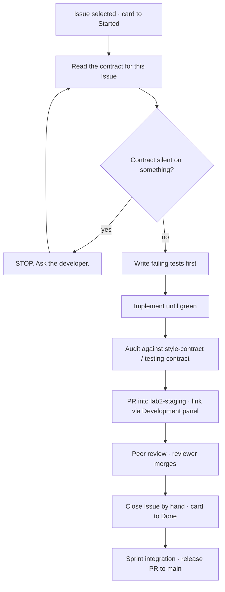

# TokTickIT — Engineering Contract for AI Developer Agents

This file is the entry point for any AI agent working in this repository. Read it before touching code. It defines what the contract documents are, the order to consult them, and the norms that govern how work is done.

Structure and norms follow the Spec-Driven Development model taught in CPE334 Lecture 4 (*Beyond Vibe Coding to Agentic Engineering*, slides 76–83 and 153–156), adapted from the `agents_md` exemplar to this project's stack.

---

## 1. Contract Documents

| Path | SDD stage | What it settles |
| :--- | :--- | :--- |
| `AGENTS.md` | Process entrypoint | Lifecycle, agent roles, work norms |
| `docs/lab-02/specification.md` | Feature-Level SDS | Scope, FR, BR, data model, AC, Definition of Done |
| `docs/lab-02/api-spec.md` | API design spec | Endpoints, request/response shapes, status codes, errors |
| `docs/lab-02/ui-spec.md` | UI design spec | Zen Green tokens, typography, control states, screen states |
| `docs/lab-02/style-contract.md` | UI compliance gate | The short checklist enforced on every UI diff |
| `docs/lab-02/testing-contract.md` | STS | Test families, identifiers, authoring standards |
| `docs/lab-02/diagrams.md` | Design models | Class and Activity diagrams |
| `docs/lab-02/tests.md` | Test plan | The planned tests and AC traceability |

`specification.md` is the source of truth. `style-contract.md` and `testing-contract.md` are enforcement gates: short enough to run against a diff without re-reading the full specifications.

### Reading order

Consult only what the task needs. Reading everything wastes context and dilutes attention.

| Task | Read |
| :--- | :--- |
| Backend endpoint | `specification.md` §4 §5 §7 §8 · `api-spec.md` · `testing-contract.md` |
| UI screen | `specification.md` §4 §5 §6 · `ui-spec.md` · `style-contract.md` |
| Schema or migration | `specification.md` §7 §11 · `diagrams.md` |
| Writing tests | `testing-contract.md` · `tests.md` · the AC being proved |
| Reviewing a PR | `style-contract.md` or `testing-contract.md` — whichever the diff touches |

---

## 2. Lifecycle

The eleven-step SDD lifecycle from Lecture 4, as it applies to this repository. Steps 1–6 are complete for this sprint; the loop below runs once per Issue.

**Branch flow.** `feature/<n>-<slug>` → `lab2-staging` → `main`. Never open a PR directly against `main` except the single release PR.

**Two manual steps after every merge.** Because PRs target `lab2-staging` rather than the default branch, GitHub does not act on `Closes #N`. The Issue must be closed by hand and the board card moved to Done. The PR↔Issue link must likewise be made through the Development panel in the browser; the keyword alone does not create it, and no API mutation exists for it.

---

## 3. Agent Roles

The work runs as a single agent by default. These roles describe hats that agent wears, and mark the natural seams if a sub-agent is delegated.

* **Builder** — implements one Issue against its contract. Consumes `specification.md`, `api-spec.md`, `ui-spec.md`.
* **Style Auditor** — loads *only* `style-contract.md` and the modified UI files, and reports token violations. Deliberately blind to business logic so that style drift is not rationalised away.
* **Test Author** — derives tests from `testing-contract.md` and the acceptance criteria, never from the implementation.
* **Spec Auditor** — checks the diff against `specification.md` and reports drift in either direction: behaviour that no requirement asked for, and requirements with no code.

The human is the **Orchestrator**: reviews and approves, and owns the blueprint.

---

## 4. Work Norms

**Strict Closed-World Rule.** If the specification is silent on a design choice, stop and ask. Do not invent a default, do not infer one from a similar project, and do not pick the option that is easiest to implement. A gap in the specification is a defect in the specification, and fixing it there is cheaper than discovering the invented behaviour during review. State the gap, propose options with a recommendation, and wait.

**Tests precede implementation.** Write the failing test first, and confirm it fails *for the intended reason* — a test that fails because of a typo or a missing import proves nothing. No feature is complete without automated verification. Every assertion cites the `FR-`, `BR-`, or `AC-` identifier it proves.

**No silent contradiction.** A feature specification may extend the System-Level SDS but may not contradict it without a recorded decision. Deviations belong in `specification.md` §11 with their reason. The same applies to this sprint's own documents: if implementation reveals that a specification is wrong, amend the specification in the same PR rather than writing code that disagrees with it.

**Theme compliance.** Colour, spacing, and typography come from the Zen Green tokens defined in `ui-spec.md`. No hard-coded hex values and no default Bootstrap colour utilities for themed surfaces. `style-contract.md` is the gate.

**Ownership is enforced on the server.** Hiding a control in the UI is not access control. Every ownership rule is enforced in the request handler and proved by a test that calls the API directly, outside the UI.

**Never commit** secrets, `.env`, credentials, uploaded files, `node_modules`, build output, or course material. Database passwords must not appear in committed files or in submitted screenshots.

**Comments are one or two lines.** Never a paragraph, never a multi-paragraph block, JSDoc included. Keep the identifier a construct traces to (`BR-04`, `§11.13`, `TDT-02`) and the non-obvious reason where there is one; drop anything that restates the code or re-argues a decision `docs/lab-02/` already records. Rationale in a document is read once, deliberately; in code it is read every time, and a paragraph above a three-line function makes that function harder to find. The same applies to Pull Request descriptions: a list first, long reasoning collapsed underneath.

**Scope discipline.** Implement the Issue in front of you. Improvements noticed along the way are recorded, not performed — an unrelated change in a diff costs the reviewer more than it saves.
