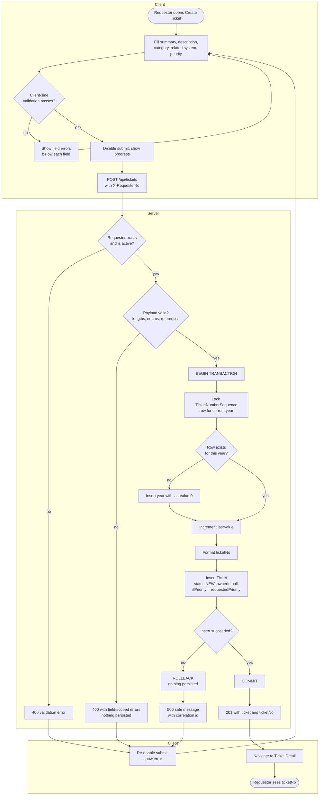

# Design Diagrams

**Version:** 1.0 — 25 August 2026

UML models for the Lab 2 sprint scope, in the notation taught in Lecture 4 (*UML, SDS Features, STS Features*). Written in Mermaid so they render on GitHub and stay reviewable in a diff.

Two diagrams are included: a **class diagram**, which fixes the structure `specification.md` §7 describes in prose, and an **activity diagram**, which fixes the ticket-creation control flow — the one place in this sprint where ordering and transaction boundaries carry real design weight. Use-case and sequence diagrams are not included; the sprint scope is a single actor performing four operations, and neither diagram would decide anything the specification has not already settled.

Where a diagram and `specification.md` disagree, the specification wins and the diagram is corrected.

---

## 1. Class Diagram

Structure of the sprint's domain. Fields shown are those that carry design meaning; audit timestamps are omitted from the boxes and are present on every entity.

```mermaid
classDiagram
    class RequesterUser {
        +UUID id
        +String displayName
        +String email
        +Boolean isActive
    }

    class Category {
        +UUID id
        +String name
        +Boolean isActive
    }

    class RelatedSystem {
        +UUID id
        +String name
        +Boolean isActive
    }

    class Ticket {
        +UUID id
        +String ticketNo
        +String summary
        +String description
        +Priority requestedPriority
        +Priority itPriority
        +TicketStatus status
        +UUID ownerId
    }

    class Attachment {
        +UUID id
        +String originalFilename
        +String storedFilename
        +String mimeType
        +Int sizeBytes
        +DateTime removedAt
        +String removedReason
        +isActive() Boolean
    }

    class TicketNumberSequence {
        +Int year
        +Int lastValue
    }

    class Priority {
        <<enumeration>>
        LOW
        MEDIUM
        HIGH
        URGENT
    }

    class TicketStatus {
        <<enumeration>>
        NEW
        ASSIGNED
        IN_PROGRESS
        PENDING_REQUESTER
        RESOLVED
        CLOSED
        CANCELLED
    }

    RequesterUser "1" --> "0..*" Ticket : raises
    RequesterUser "1" --> "0..*" Attachment : uploads
    Category "1" --> "0..*" Ticket : classifies
    RelatedSystem "1" --> "0..*" Ticket : concerns
    Ticket "1" *-- "0..*" Attachment : carries
    Ticket ..> Priority : uses
    Ticket ..> TicketStatus : uses
```

**What the notation is asserting.**

`Ticket` composes `Attachment` (filled diamond): an attachment has no meaning apart from its ticket and does not outlive it. Every other association is a plain reference — a `Category` exists whether or not any ticket uses it, which is why reference tables are deactivated with `isActive` rather than deleted (§7).

`TicketNumberSequence` connects to nothing. It is deliberately outside the domain graph: it is allocation infrastructure serving BR-04 and BR-05, not a domain concept, and giving it an association to `Ticket` would invite treating it as one.

`ownerId` is present on `Ticket` but has no association drawn, because the IT Staff entity it will reference does not exist in this sprint. It stays null throughout (BR-07). It is modelled now so that Lab 3 adds a foreign key rather than a column.

`Attachment.isActive()` is derived from `removedAt` rather than stored. A stored flag alongside a removal timestamp can disagree with itself; one field cannot.

---

## 2. Activity Diagram — Create Ticket

Control flow for `POST /api/tickets` (FR-05 … FR-11). The partitions separate what the client owns from what the server owns, which is the point the diagram exists to make: no validation result the client produces is trusted, and every decision that matters is re-made server-side.

**What the notation is asserting.**

The sequence-number allocation sits *inside* the transaction, between `BEGIN` and `COMMIT`, and begins by locking the year's row. This is the design decision recorded in §7: allocating the number before opening the transaction, or deriving it from `MAX(ticketNo)`, admits two concurrent creations claiming the same number. The row lock is what makes BR-05 hold, and TC-010 is the test that proves it.

Validation appears twice, once per partition, and the two are not equivalent. The client copy exists to give fast feedback; the server copy exists because the client can be bypassed entirely. Every rejection path returns before `BEGIN TRANSACTION`, so a rejected request cannot leave a partial row — the property TC-007 verifies by reading back rather than trusting the status code.

The submit button is disabled on the client before the request is issued and re-enabled only on a terminal outcome. That is what BR-13 requires and STY-022 enforces: it makes double submission impossible from the UI, while the transaction makes it harmless if it happens anyway.

Every failure path returns to the form with the entered values intact. Discarding the requester's typing on a server error would satisfy the letter of the specification and fail its intent (AC-30).
